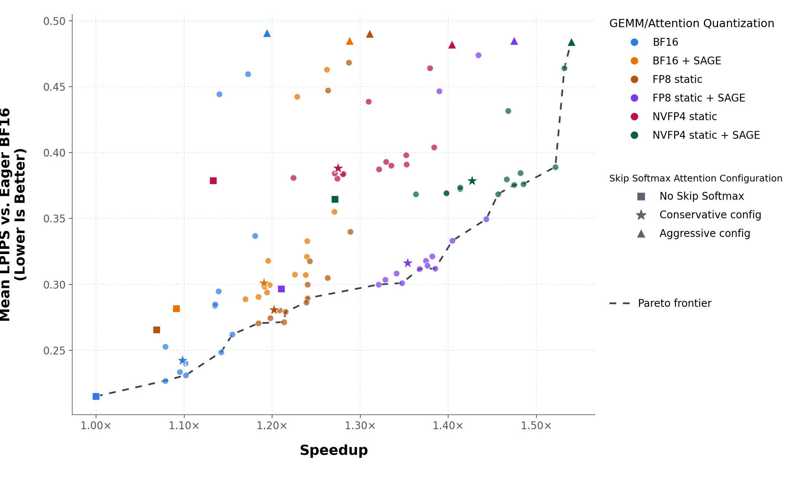
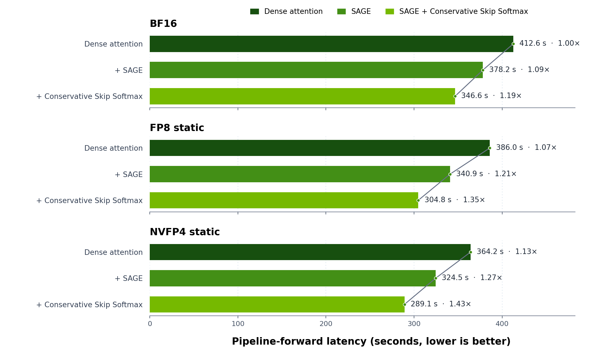
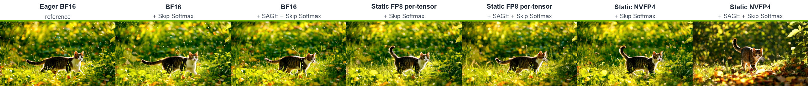
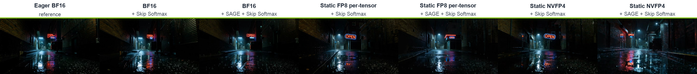
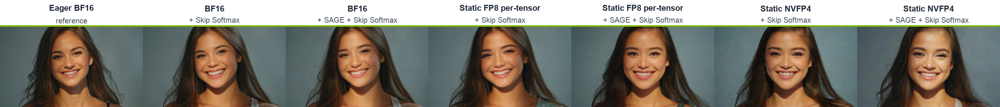
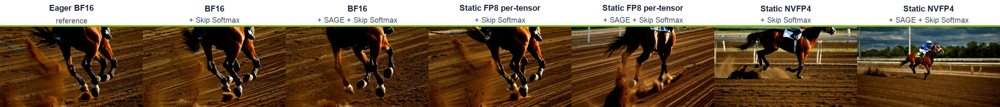

# Accelerating Video Generation with GEMM Quantization, Attention Quantization and Skip Softmax Attention in TensorRT-LLM

By NVIDIA TensorRT-LLM Team

## Introduction

Video diffusion transformers repeatedly process long spatiotemporal token sequences across many denoising steps. Linear layers and attention therefore dominate much of the compute, making them the two most direct targets for reducing generation latency.

Figure 1 breaks down pipeline-forward time for Wan 2.2 T2V-A14B on a single NVIDIA B200. For an 81-frame, 1280×720 video with 40 denoising steps, attention and linear-layer GEMMs account for 70.3% and 21.0% of BF16 pipeline-forward time, respectively.

<p align="center">
  
</p>

<p align="center"><sub><em>Figure 1. Pipeline-forward breakdown for dense BF16 on B200.</em></sub></p>

Our earlier post, [Scaling Video Generation Across NVL72 Rack with TensorRT-LLM](https://github.com/NVIDIA/TensorRT-LLM/blob/main/docs/source/blogs/tech_blog/blog25_Scaling_Video_Generation_Across_NVL72_Rack_with_TensorRT-LLM.md), focused on scale-out. This post covers three complementary acceleration techniques inside one transformer pipeline: linear-layer quantization, quantized attention, and sparse attention. The central question is how to reduce latency without giving up more visual quality than the application can tolerate.

## Table of Contents

- [GEMM Quantization](#gemm-quantization)
- [Attention Optimizations](#attention-optimizations)
- [Results](#results)
- [Reproduction](#reproduction)
- [Conclusion](#conclusion)
- [References](#references)

## GEMM Quantization

Linear-layer quantization reduces the numerical precision of weights and activations so their GEMMs can use higher-throughput Tensor Core paths. TensorRT-LLM VisualGen supports the following GEMM quantization paths:

| Linear-layer path | `quant_algo` | Weight / activation precision | Scale granularity |
| :--- | :--- | :--- | :--- |
| FP8 per-tensor | `FP8` | FP8 E4M3 / FP8 E4M3 | One scale per tensor |
| FP8 blockwise | `FP8_BLOCK_SCALES` | FP8 E4M3 / FP8 E4M3 | 128×128 weight blocks; 1×128 activation blocks |
| FP8 row-wise | `FP8_PER_CHANNEL_PER_TOKEN` ([WIP](https://github.com/NVIDIA/TensorRT-LLM/pull/16847)) | FP8 E4M3 / FP8 E4M3 | Per-output-channel weights; per-token activations |
| NVFP4 | `NVFP4` | FP4 E2M1 / FP4 E2M1 | 16-element blocks with FP8 scale factors |

- **Static quantization:** Representative inputs are used before inference to find weight and activation scales that make effective use of the limited FP8 or FP4 range. Accuracy-sensitive layers can remain in higher precision instead of being quantized. The resulting checkpoint stores quantized weights together with `weight_scale` and `input_scale` tensors; `input_scale` is the calibrated scale applied to runtime activations. The public checkpoints used in this post were calibrated with [NVIDIA Model Optimizer (ModelOpt)](https://github.com/NVIDIA/Model-Optimizer).
- **Dynamic quantization:** Dynamic quantization skips offline calibration. VisualGen starts from a BF16 checkpoint, quantizes weights while loading the model, and computes activation scales as the model runs. This makes quantization easy to try without preparing a separate checkpoint, but it generally preserves less accuracy than static quantization with calibrated scales and selectively retained high-precision layers.

In this blog, we test the static `FP8` and `NVFP4` using the [FP8 per-tensor](https://huggingface.co/nvidia/Wan2.2-T2V-A14B-Diffusers-FP8) and [NVFP4](https://huggingface.co/nvidia/Wan2.2-T2V-A14B-Diffusers-NVFP4) Wan 2.2 T2V checkpoints published by ModelOpt.

## Attention Optimizations

There are two orthogonal directions for accelerating attention: quantized attention lowers numeric precision, while sparse attention omits contributions from unimportant blocks and saves the corresponding computation.

### Quantized Attention

An attention layer performs two matrix multiplications around softmax. SAGE Attention quantizes Q/K as well as V, allowing both multiplications to run through an 8-bit path. TensorRT-LLM's SAGE recipe follows the [SageAttention2](https://arxiv.org/abs/2411.10958) line of work, using INT8 or FP8 Q/K and FP8 V rather than the paper's per-thread INT4 Q/K recipe.

This post uses SAGE, which can be layered with Skip Softmax to combine quantization and sparsity in the same attention path.

### Sparse Attention with Skip Softmax

[Skip Softmax Attention](blog16_Accelerating_Long_Context_Inference_with_Skip_Softmax_Attention.md), also called BLASST, keeps the QK calculation but rejects score blocks sufficiently below the running maximum. Rejected blocks skip exponentiation and the corresponding `P×V` accumulation; the sparsity pattern is determined dynamically rather than stored with the model.

`target_sparsity` controls how aggressively to skip, while `disabled_until_timestep` keeps the early denoising steps dense. In the 40-step UniPC schedule used here, `disabled_until_timestep=0.86` corresponds to 14 initial dense steps followed by 26 Skip Softmax steps. Calibration also protects sensitive layers by leaving them on dense attention. See the [VisualGen Skip Softmax timestep documentation](https://github.com/NVIDIA/TensorRT-LLM/blob/main/docs/source/visual-gen/features/sparse-attention.md#mapping-disabled_until_timestep-to-actual-denoising-steps) for the definition and scheduler-dependent mapping.

## Results

### Experimental setup

We evaluate the three techniques on a fixed Wan 2.2 workload while varying linear-layer precision, attention precision, and Skip Softmax settings.

| Item | Setting |
| :--- | :--- |
| Checkpoints | [BF16](https://huggingface.co/Wan-AI/Wan2.2-T2V-A14B-Diffusers), [static FP8 per-tensor](https://huggingface.co/nvidia/Wan2.2-T2V-A14B-Diffusers-FP8), and [static NVFP4](https://huggingface.co/nvidia/Wan2.2-T2V-A14B-Diffusers-NVFP4) |
| Accelerator | NVIDIA B200 |
| Generated video | 1280×720, 81 frames at 16 FPS |
| Denoising | 40 steps; guidance 4.0 for the high-noise expert and 3.0 for the low-noise expert |
| Linear-layer paths | BF16, ModelOpt static FP8 per-tensor, ModelOpt static NVFP4 |
| Attention paths | Dense, or SAGE with INT8 Q/K, FP8 V, and Q/K/V block sizes of 1/16/1 |

The static checkpoints include calibrated Skip Softmax metadata for both Wan transformers. For the BF16 Skip Softmax rows, the same metadata is added to the BF16 checkpoint.

We use two baselines:

- **Quality:** LPIPS compares each video with an eager BF16 generation from the same prompt and seed.
- **Speed:** Speedup compares pipeline-forward latency with compiled dense BF16, whose mean latency is **412.6 seconds** across the seven prompts. This excludes compilation's own speedup and isolates the three optimizations studied here.

Compilation can change kernel fusion and floating-point operation ordering, so compiled dense BF16 is not numerically identical to eager BF16. It therefore appears at `1.00×` speedup but has a nonzero mean LPIPS of `0.2150` against the eager quality baseline.

The 96 configurations are a characterization sweep, not a recommended per-model tuning cost:

```text
{BF16 reference, static FP8 per-tensor, static NVFP4}
× {dense attention, SAGE}
× {no Skip Softmax, or
   target_sparsity {0.65, 0.70, 0.75}
   × disabled_until_timestep {0.86, 0.90, 0.94, 0.97, 1.00}}
```

Every setting uses the same seven prompt-and-seed pairs. Latency covers one complete 40-step pipeline forward; model loading, HTTP handling, and video encoding are outside the measurement. These 96 points form the quality-speed frontier shown next.

### Quality-speed frontier

Skip Softmax introduces an explicit quality-speed tradeoff. Figure 2 maps every configuration instead of reducing the sweep to a few hand-picked points. Squares mark runs without Skip Softmax; stars mark the conservative configuration (`target_sparsity=0.75`, `disabled_until_timestep=0.86`); and triangles mark the aggressive end of the sweep (`target_sparsity=0.75`, `disabled_until_timestep=1.00`). The triangles show the upper-speed end of the sweep rather than a recommended setting. The remaining sweep points are circles, and the dashed line traces the global Pareto frontier.

<p align="center">
  
</p>

<p align="center"><sub><em>Figure 2. Speedup–quality frontier across all 96 configurations. LPIPS is measured against eager BF16; speedup is relative to compiled dense BF16.</em></sub></p>

### Frontier analysis

The table condenses the 18 marked points into six family rows. Each cell reports `speedup / mean LPIPS`; the star and triangle use the same Skip Softmax settings as Figure 2.

| GEMM/attention quantization | ■ No Skip Softmax | ★ Conservative Skip Softmax | ▲ Aggressive Skip Softmax |
| :--- | :--- | :--- | :--- |
| BF16 | 1.000× / 0.2150 | 1.098× / 0.2422 | 1.194× / 0.4910 |
| BF16 + SAGE | 1.091× / 0.2815 | 1.191× / 0.3011 | 1.288× / 0.4851 |
| Static FP8 per-tensor | 1.069× / 0.2654 | 1.202× / 0.2807 | 1.311× / 0.4904 |
| Static FP8 per-tensor + SAGE | 1.210× / 0.2966 | 1.354× / 0.3164 | 1.475× / 0.4850 |
| Static NVFP4 | 1.133× / 0.3785 | 1.275× / 0.3883 | 1.404× / 0.4821 |
| Static NVFP4 + SAGE | 1.272× / 0.3646 | 1.427× / 0.3786 | 1.540× / 0.4843 |

Static FP8 stays close to BF16 in LPIPS while reducing latency, whereas NVFP4 moves to a faster operating range with a larger quality tradeoff. This makes the GEMM format the broadest choice in the frontier.

SAGE shifts every GEMM family toward higher speedup with a smaller LPIPS change than the move between GEMM formats. It can therefore be selected independently before using Skip Softmax to fine-tune the operating point.

Skip Softmax then fills the space within each family. `target_sparsity` controls how much work can be rejected, while `disabled_until_timestep` controls how early that rejection begins. Together they provide a continuum between the conservative stars and aggressive triangles instead of a single all-or-nothing sparse mode.

This layered structure explains the Pareto frontier. Its higher-speed region is dominated by static FP8 and NVFP4 configurations that combine SAGE with Skip Softmax. GEMM quantization selects the broad operating range; SAGE and Skip Softmax then provide finer control within it.

### Latency step-down

Figure 3 isolates the attention optimizations within each GEMM precision. Each group starts with dense attention, adds SAGE, and then adds the conservative Skip Softmax setting from the frontier. The bars report absolute pipeline-forward latency, while their labels retain the common speedup against compiled dense BF16.

<p align="center">
  
</p>

<p align="center"><sub><em>Figure 3. Pipeline-forward latency after successively adding SAGE and conservative Skip Softmax within each GEMM precision. Lower is better.</em></sub></p>

### Visual validation

Video quality includes motion consistency and temporal stability, which a framewise metric cannot show on its own. Figure 4 compares P1 across the eager reference and all six optimized families. Every optimized video uses the conservative star setting from the frontier: `target_sparsity=0.75` and `disabled_until_timestep=0.86`. Speedup is relative to compiled dense BF16; eager BF16 is included only as the visual reference.

| Eager BF16 reference | BF16 + Skip Softmax (1.10×) |
| :---: | :---: |
|  |  |
| **BF16 + SAGE + Skip Softmax (1.19×)** | **Static FP8 per-tensor + Skip Softmax (1.20×)** |
|  |  |
| **Static FP8 per-tensor + SAGE + Skip Softmax (1.35×)** | **Static NVFP4 + Skip Softmax (1.27×)** |
|  |  |
| **Static NVFP4 + SAGE + Skip Softmax (1.43×)** | |
|  | |

<p align="center"><sub><em>Figure 4. P1 video comparison across the eager BF16 reference and six conservative Skip Softmax configurations.</em></sub></p>

Figure 5 expands the first-frame comparison to all seven prompts. Each row compares the eager reference with the same six conservative configurations as Figure 4, and each generated frame retains its original 384×216 pixels.

<p align="center">
  
</p>

<p align="center">
  
</p>

<p align="center">
  
</p>

<p align="center">
  
</p>

<p align="center">
  
</p>

<p align="center">
  
</p>

<p align="center">
  
</p>

<p align="center"><sub><em>Figure 5. First-frame comparison across all seven prompts. Every Skip Softmax result uses `target_sparsity=0.75` and `disabled_until_timestep=0.86`, corresponding to the stars in Figure 2.</em></sub></p>

## Reproduction

The commands below target TensorRT-LLM 1.3.0rc26. Choose either the [static FP8 per-tensor checkpoint](https://huggingface.co/nvidia/Wan2.2-T2V-A14B-Diffusers-FP8) or the [static NVFP4 checkpoint](https://huggingface.co/nvidia/Wan2.2-T2V-A14B-Diffusers-NVFP4). The checkpoint selects the GEMM format and supplies the calibrated quantization scales and Skip Softmax metadata.

### VisualGen configuration

Save the following configuration as `visual_gen.yaml`. It enables SAGE and the conservative Skip Softmax setting used by the stars in Figure 2:

```yaml
attention_config:
  backend: TRTLLM
  quant_attention_config:
    qk_dtype: int8
    v_dtype: fp8
    q_block_size: 1
    k_block_size: 16
    v_block_size: 1
  sparse_attention_config:
    algorithm: skip_softmax
    target_sparsity: 0.75
    disabled_until_timestep: 0.86

torch_compile_config:
  enable: true
  enable_autotune: false
```

The `quant_attention_config` block selects SAGE independently of GEMM precision. The configuration uses INT8 Q/K, FP8 V, and Q/K/V block sizes of 1/16/1 on the `TRTLLM` backend. Remove this block to keep attention unquantized while retaining Skip Softmax.

The `sparse_attention_config` block controls Skip Softmax:

- `target_sparsity` is converted to a threshold through each transformer's calibration formula, so achieved sparsity can vary by layer and timestep.
- This `target_sparsity` form requires checkpoint calibration metadata. Without calibration, Skip Softmax can instead be enabled by configuring `threshold_scale_factor` directly. See the [VisualGen Skip Softmax Attention documentation](https://github.com/NVIDIA/TensorRT-LLM/blob/main/docs/source/visual-gen/features/sparse-attention.md#skip-softmax-attention) for direct-threshold configuration.
- `disabled_until_timestep` controls when skipping begins as denoising descends from near 1 to 0: a lower value keeps more early steps dense.

### Run with trtllm-serve

Start `trtllm-serve` with the NVFP4 checkpoint and the configuration above. Replace the model ID with the FP8 checkpoint to switch the GEMM format without changing the YAML:

```bash
export MODEL=nvidia/Wan2.2-T2V-A14B-Diffusers-NVFP4
trtllm-serve "$MODEL" --visual_gen_args visual_gen.yaml
```

Then submit the P1 prompt from another shell. The synchronous endpoint returns the encoded video directly:

```bash
curl --fail --silent --show-error \
    --request POST http://localhost:8000/v1/videos/sync \
    --header 'Content-Type: application/json' \
    --output wan22_nvfp4_sage_skip.mp4 \
    --data '{
      "prompt": "A cat walking through a sunlit garden, gentle breeze rustling leaves, slow tracking shot",
      "width": 1280,
      "height": 720,
      "num_frames": 81,
      "frame_rate": 16,
      "num_inference_steps": 40,
      "guidance_scale": 4.0,
      "seed": 1001,
      "format": "mp4",
      "extra_params": {
        "guidance_scale_2": 3.0
      }
    }'
```

<details>
<summary>Seven-prompt evaluation manifest</summary>

| ID | Seed | Prompt |
| :--- | ---: | :--- |
| `p01_cat_garden` | 1001 | A cat walking through a sunlit garden, gentle breeze rustling leaves, slow tracking shot |
| `p03_park_kids` | 1003 | Children playing in a busy park, a golden retriever running between them, sunny afternoon, wide shot |
| `p04_drone_coast` | 1004 | Drone shot flying over a rugged coastline at sunset, waves crashing on cliffs below, golden hour lighting |
| `p05_neon_sign` | 1005 | A neon sign reading 'OPEN' flickering in a rainy alley at night, reflections on wet pavement, cinematic |
| `p06_woman_smile` | 1006 | A young woman smiling at the camera, soft studio lighting, slight head tilt, cinematic close-up portrait |
| `p07_horse_gallop` | 1007 | A racehorse galloping on a dirt track, kicking up dust, side tracking shot, dramatic lighting |
| `p10_market` | 1010 | A bustling outdoor street market with people walking and vendors selling fresh fruit, Mediterranean style, midday sun |

</details>

For the reported latency, a complete 40-step pipeline forward is bracketed by CUDA synchronization, and the seven prompt times are averaged. Video encoding is outside this timed region. The eager BF16 quality reference disables compilation, quantization, SAGE, and Skip Softmax. AlexNet LPIPS is computed between corresponding frames, averaged over all 81 frames and then over the seven prompts.

## Conclusion

Accelerating video diffusion is not a single precision switch. It is a process of deciding where the pipeline can tolerate lower precision and where it can safely avoid work altogether. TensorRT-LLM exposes linear-layer quantization, quantized attention, and Skip Softmax as composable controls, so deployments can choose an operating point that matches their own quality bar instead of inheriting one fixed recipe.

That operating point is model-, prompt-, and hardware-dependent. A useful optimization workflow therefore combines representative prompts, deployment-relevant latency, aggregate quality metrics, and direct inspection of generated videos. Future work can explore agentic search to automate these experiments and navigate the speed-quality tradeoff.

These single-GPU techniques are also orthogonal to the scale-out methods in [Scaling Video Generation Across NVL72 Rack with TensorRT-LLM](https://github.com/NVIDIA/TensorRT-LLM/blob/main/docs/source/blogs/tech_blog/blog25_Scaling_Video_Generation_Across_NVL72_Rack_with_TensorRT-LLM.md), and can be combined with multi-GPU parallelism when the deployment requires higher throughput or larger workloads.

## References

1. [Scaling Video Generation Across NVL72 Rack with TensorRT-LLM](https://github.com/NVIDIA/TensorRT-LLM/blob/main/docs/source/blogs/tech_blog/blog25_Scaling_Video_Generation_Across_NVL72_Rack_with_TensorRT-LLM.md)
2. [SageAttention: Accurate 8-Bit Attention for Plug-and-play Inference Acceleration](https://arxiv.org/abs/2410.02367)
3. [SageAttention2: Efficient Attention with Thorough Outlier Smoothing and Per-thread INT4 Quantization](https://arxiv.org/abs/2411.10958)
4. [NVIDIA Model Optimizer Diffusers Quantization Example](https://github.com/NVIDIA/Model-Optimizer/tree/main/examples/diffusers)
5. [BLASST: Dynamic BLocked Attention Sparsity via Softmax Thresholding](https://arxiv.org/abs/2512.12087)
